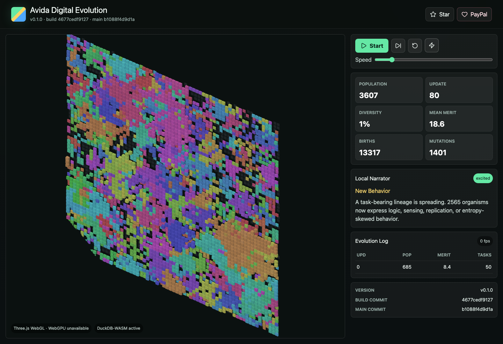
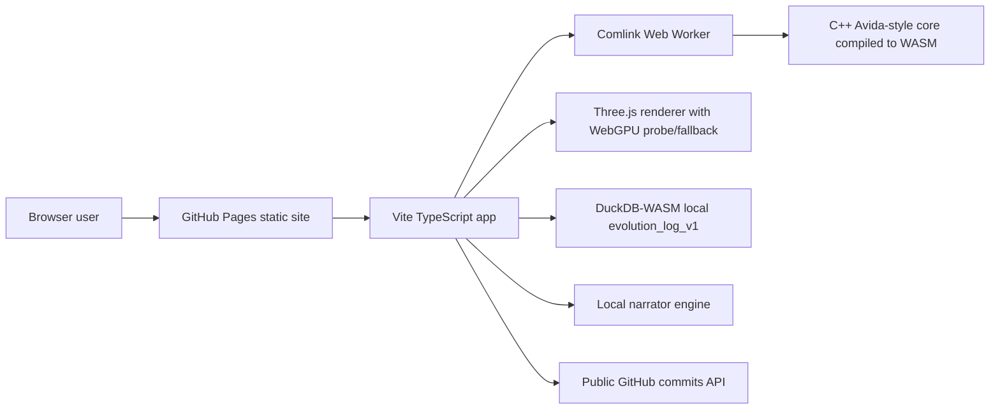

# Avida Digital Evolution


Browser-based artificial life sandbox where WASM organisms evolve, render, and get narrated locally.

Live site:

https://baditaflorin.github.io/avida-digital-evolution/

Repository:

https://github.com/baditaflorin/avida-digital-evolution

Support:

https://www.paypal.com/paypalme/florinbadita



## Why

Avida Digital Evolution makes artificial-life dynamics playable in a tab: a compact C++ evolution core runs as WASM, Three.js renders the organism grid, DuckDB-WASM records local generation logs, and a local narrator explains the pressure shifts as lineages compete.

## Quickstart

```sh
git clone https://github.com/baditaflorin/avida-digital-evolution.git
cd avida-digital-evolution
npm install
make install-hooks
make dev
```

## Architecture



Full architecture notes:

docs/architecture.md

ADRs:

docs/adr/

## Commands

```sh
make test
make lint
make build
make smoke
make pages-preview
```

## Deployment

The app is Mode A: Pure GitHub Pages. Pages serves committed static files from `main` branch `/docs`.

Deploy guide:

docs/deploy.md

## Version

The live page displays:

- package version
- build commit
- latest `main` commit fetched from the public GitHub API
