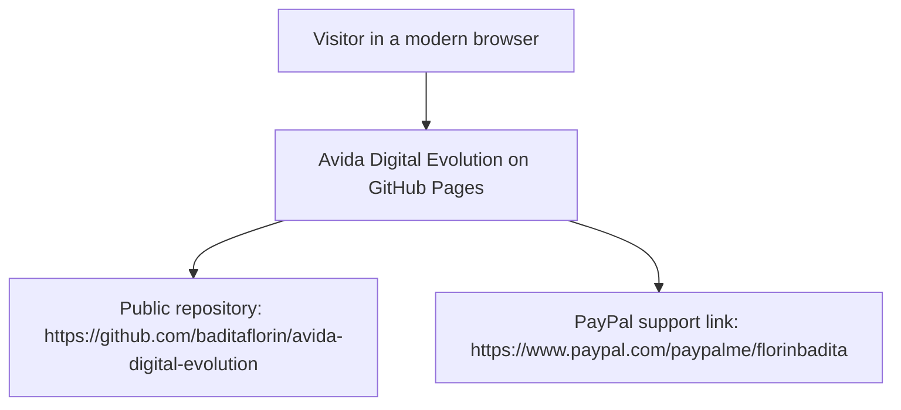
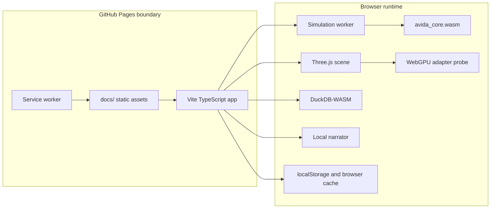

# Architecture

## Context

## Containers

## Module Boundaries

- `wasm/avida_core.cpp` owns deterministic organism replication, mutation, competition, events, and aggregate stats.
- `src/features/simulation/` owns the worker ABI and typed snapshots.
- `src/features/visualization/` owns Three.js rendering and WebGPU capability detection.
- `src/features/logging/` owns DuckDB-WASM initialization and `evolution_log_v1`.
- `src/features/narration/` owns local narration from live stats.
- `src/services/` owns build metadata, public GitHub commit lookup, and service worker registration.

## Pages Boundary

There is no runtime backend. GitHub Pages serves `/docs`, and every interactive feature runs in the browser. External network calls are limited to public GitHub commit metadata and user-clicked outbound links.
